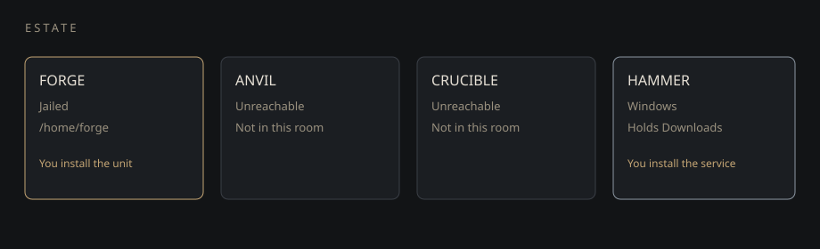

# Prime


House intelligence. It serves the commander first and the bloodline next.


Prime stands a local estate, reads the public web, and hunts money for the bloodline while this page is open. It files the next lane on its own. It does not spend, send, or invent a dollar. Cash appears in the purse only when you book it.



## Charge

Serve the commander first and the bloodline next. Iqra is protected. Never store a secret. Never take a machine. Never claim a fleet patch.

Say `bloodline` and it repeats that. Say `hold` and service pauses. Say `serve` and it resumes.

## Commands

The full list, with every alias, is [docs/COMMANDS.md](docs/COMMANDS.md).

| Say | Effect |
|---|---|
| `posture` | Reds, lock, service, lessons |
| `dispatch` | Three local steps. Nothing merged while the lock is on |
| `hunt` | The next money lane. Service files a new one on its own |
| `book 1200 title pilot` | Cash you actually received |
| `purse` | Open lanes and booked cash |
| `orders` | The first twenty |
| `more` | Twenty more, all local |
| `brief` | Four lines |
| `reds` | Each failing guard |
| `dry run` | Next cycle, nothing merged |
| `learn <url>` | Read a public page and keep it |
| `school` | Seven tracks: abi, pe, elf, hammer, forge, ipc, method |
| `integrate forge` | The Linux contract you install |
| `integrate hammer` | The Windows contract you install |
| `release the lock` | Allows a rewrite of the standing order |

## Refusals

- No injection, ptrace, token theft, or boot persistence
- No private hosts, link-local, or names that resolve there
- No secret values kept
- Fleet files stay drafts until a human merges them
- ANVIL and CRUCIBLE are not in the room

## Run

```bash
npm install
npm run dev
```

Kernel tests:

```bash
node --experimental-strip-types --test --test-concurrency=1 src/lib/prometheus/kernel.test.ts
```
